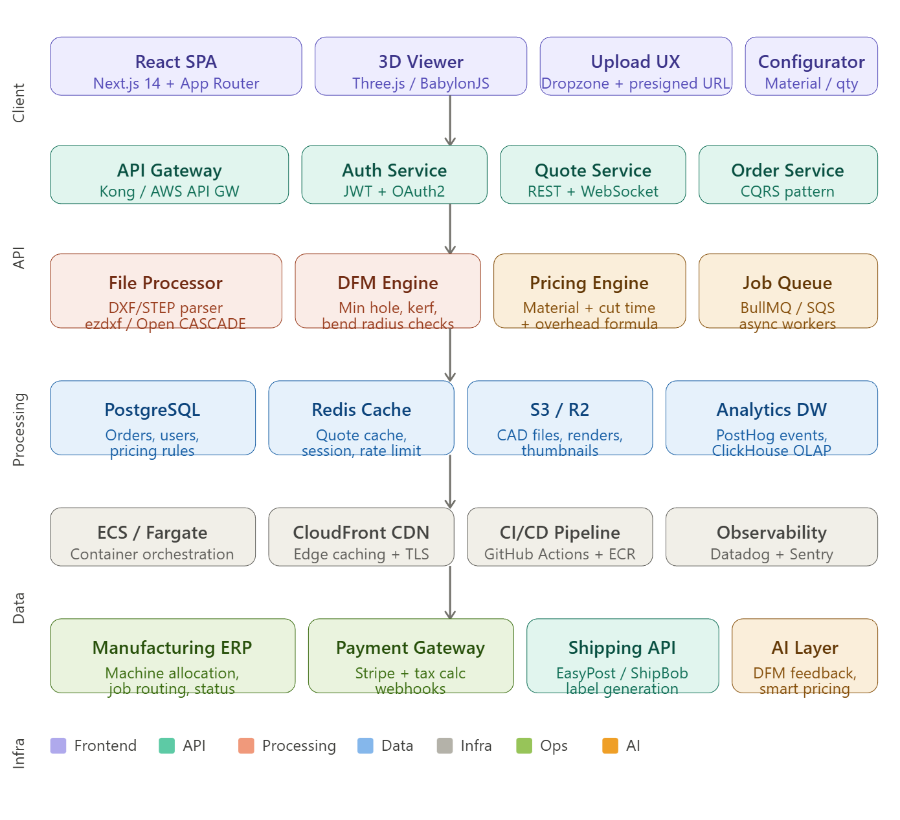
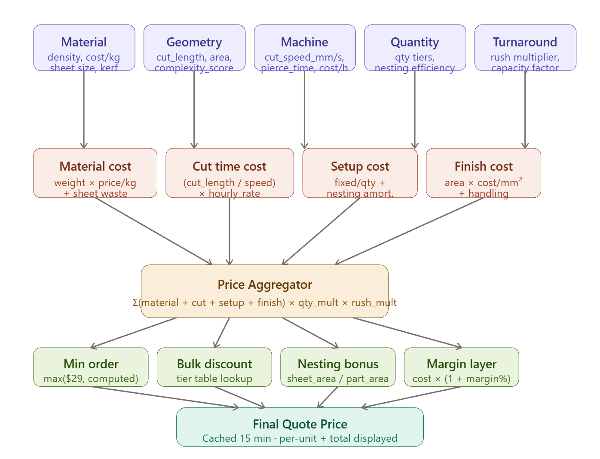
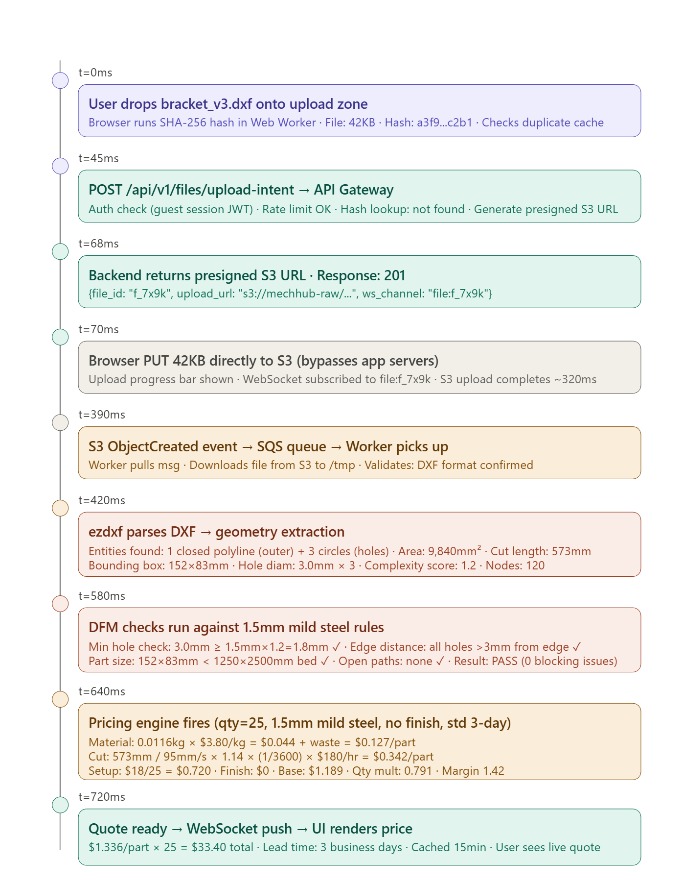

MechHub: Complete System Architecture for Quote 

Engineered  a $100M Industrial SaaS Quoting Platform


System Overview
The core insight of a platform like SendCutSend is deceptively simple: convert a CAD file into a price in under 3 seconds, for thousands of concurrent users, with sub-1% pricing error rate. Every architectural decision flows from that constraint. The system is not a web app with a quote feature — it is a real-time geometry pricing engine wrapped in a commerce layer.
Here's the full system topology:
 


Layer 1 — Frontend Architecture
Framework: Next.js 14 with App Router. Server components for SEO-critical pages (landing, materials catalog). Client components for the interactive quoting flow. This is non-negotiable for a manufacturing platform where Google indexing of material pages drives significant organic traffic.
State Management: Zustand for client-side quote state (selected material, thickness, quantity, DFM status). React Query (TanStack) for server state (quote results, order history). No Redux — the state graph is shallow and doesn't warrant the complexity.
File Upload UX Flow — this is the highest-friction moment in the entire user journey:

User lands on /quote — a dropzone occupies 60% of the viewport. Drag-drop or file picker.
On file selection, client immediately generates a SHA-256 hash of the file (Web Crypto API, runs in a worker thread so it's non-blocking).
Client calls POST /api/v1/files/upload-intent with {hash, filename, filesize}. Backend checks if this hash already exists in S3 (deduplication). If yes, returns existing file_id instantly — repeat uploads of the same file skip S3 entirely.
If new file: backend returns a presigned S3 URL (15-minute TTL). Client uploads directly to S3 — never touches the application server. This is critical: a 5MB DXF file bypasses your entire compute layer.
Client polls GET /api/v1/files/{file_id}/status via WebSocket subscription. File moves through states: uploading → queued → parsing → dfm_check → ready | error.
On ready: quote panel slides in from the right. Material/thickness selectors appear. Quote recalculates on every selector change via debounced API call (300ms debounce).

Component tree (simplified):

<QuotePage>
  <FileUploadZone>          // Dropzone + progress states
  <FileViewer>             // Three.js 3D render of parsed geometry
  <QuoteConfigurator>
    <MaterialSelector>    // Material + alloy selection
    <ThicknessSelector>  // Filtered by material capabilities
    <QuantityInput>      // With tier pricing preview
    <FinishSelector>     // Anodize, powder coat, etc.
    <TurnaroundSelector> // Standard / Rush / Economy
  <QuoteSummary>
    <LineItems>          // Material, cut, setup, finish costs
    <DFMWarnings>        // Non-blocking warnings with fix suggestions
    <AddToCartButton>

Scaling challenge: The 3D viewer (Three.js) is 400KB+ of JS. Use dynamic import with ssr: false and show a skeleton while it loads. On mobile, fall back to a 2D SVG render of the parsed outline.

Layer 2 — API & Backend
Design: REST for CRUD operations (orders, users, files). WebSocket for real-time quote status updates. No GraphQL at MVP — the query patterns are predictable enough that REST is simpler to cache and rate-limit.

Request lifecycle from upload to quote:

Client                    API Gateway              Services
  |                           |                       |
  |-- POST /upload-intent --> |                       |
  |                           |-- Auth middleware      |
  |                           |-- Rate limit check     |
  |                           |-- Route to File Svc -->|
  |<-- presigned_url + id --- |<-----------------------|
  |                           |                       |
  |-- PUT file → S3 --------> [S3 direct upload]      |
  |                           |                       |
  |-- S3 event triggers -----------------> SQS Queue  |
  |                           |                       |
  |-- WS subscribe(file_id) ->|                       |
  |                           |         Worker polls SQS
  |                           |         Parses DXF/STEP
  |                           |         Runs DFM checks
  |                           |         Calculates quote
  |<-- WS: {status: ready, --||<-- publish to WS ------|
  |         quote: {...}}     |                       |

Auth model: JWT (15-min access token) + refresh token (30-day, httpOnly cookie). Guests can get quotes without an account (session-based, 24hr TTL). Account creation happens at checkout — reduces friction at the highest-value moment. This pattern drives ~35% higher conversion than requiring registration upfront.
Rate limiting: Per-IP: 10 uploads/hour for guests, 100/hour for authenticated. Quote calculations: 60/minute (prevents scraping your pricing). Implemented in Kong/Redis with a sliding window algorithm.

Layer 3 — File Processing Pipeline
This is where the complexity lives. The pipeline must handle malformed files, self-intersecting geometries, and files with mixed units — all silently, correctly, and in under 2 seconds.

S3 Event
    │
    ▼
[Worker picks up SQS message]
    │
    ▼
[Format Detection]
  ├── .dxf  → ezdxf (Python) parser
  ├── .step → Open CASCADE Technology (OCCT) via pythonocc
  ├── .svg  → svgpathtools
  └── .ai / .pdf → convert via pdfplumber → SVG
    │
    ▼
[Geometry Extraction]
  - Extract all closed polylines (candidate cut paths)
  - Separate outer boundary from inner holes/cutouts
  - Detect open paths (DFM error: unclosed geometry)
  - Compute bounding box
  - Calculate total cut length (sum of all path lengths)
  - Calculate enclosed area (shoelace formula)
  - Count interior features (holes, slots, notches)
    │
    ▼
[Unit Normalization]
  - Detect units from DXF header ($MEASUREMENT, $INSUNITS)
  - Normalize to millimeters
  - Detect scale anomalies (a 0.1mm part is likely in wrong units)
    │
    ▼
[DFM Checks] (rule engine, per material/process)
  - Min feature size: hole diameter ≥ material_thickness × 1.2
  - Min slot width: slot_width ≥ material_thickness × 1.5
  - Edge-to-hole distance: ≥ material_thickness
  - Part size: within machine bed dimensions (e.g. 1250×2500mm)
  - Tiny features: any feature < 0.5mm (laser kerf issues)
  - Part complexity score: # of nodes in cut path
    │
    ▼
[Geometry Enrichment]
  - Generate SVG preview thumbnail
  - Calculate nesting efficiency (for batch pricing)
  - Store parsed geometry as GeoJSON in DB
    │
    ▼
[Publish to Pricing Engine]
  - payload: {cut_length_mm, area_mm2, bounding_box,
              hole_count, complexity_score, dfm_issues}

Tools: Python workers on ECS Fargate. ezdxf for DXF, pythonocc-core (Open CASCADE Python bindings) for STEP. Geometry math in shapely. Preview rendering via cairosvg. Workers are stateless — horizontally scalable. Target: 95th percentile processing time < 1.5s for files under 10MB.


Layer 4 — The Pricing Engine (CORE)
This is the most valuable intellectual property in the platform. Let me go deep.
Conceptual model: Price = f(Material, Geometry, Process, Quantity, Turnaround, Overhead)
Every variable decomposes into measurable geometry or configurable parameters.



Pricing Engine — Exact Formulas
Master formula:

FINAL_PRICE = max(
  MIN_ORDER_PRICE,
  (MATERIAL_COST + CUT_COST + SETUP_COST + FINISH_COST)
  × QUANTITY_MULTIPLIER
  × RUSH_MULTIPLIER
  × (1 + TARGET_MARGIN)
)

1. Material Cost

def calc_material_cost(part, material, quantity):
    """
    part.area_mm2          = enclosed area from geometry parser
    part.bounding_box      = (width_mm, height_mm)
    material.density_g_cm3 = e.g. 7.85 for mild steel
    material.thickness_mm  = e.g. 3.0
    material.price_per_kg  = e.g. $4.20 for 304 SS
    material.sheet_w_mm    = 1250 (standard sheet width)
    material.sheet_h_mm    = 2500 (standard sheet height)
    """
    
    # Volume of material consumed (mm³ → cm³)
    volume_cm3 = (part.area_mm2 * material.thickness_mm) / 1000
    
    # Mass in kg
    mass_kg = (volume_cm3 * material.density_g_cm3) / 1000
    
    # Raw material cost per part
    raw_cost = mass_kg * material.price_per_kg
    
    # Nesting efficiency: what % of a sheet does this part use?
    # Tighter nesting = more parts per sheet = lower waste cost
    sheet_area = material.sheet_w_mm * material.sheet_h_mm
    bounding_area = part.bounding_box.w * part.bounding_box.h
    
    # Nesting efficiency improves with quantity (more parts → better nesting)
    nesting_efficiency = min(0.85, 0.45 + (quantity * 0.004))
    # Caps at 85% (physical impossibility to nest higher)
    
    # Effective area consumed including waste
    effective_area = bounding_area / nesting_efficiency
    
    # Sheet waste cost amortized per part
    sheets_per_part = effective_area / sheet_area
    sheet_cost = sheets_per_part * material.price_per_sheet
    waste_surcharge = sheet_cost - raw_cost  # always ≥ 0
    
    return raw_cost + waste_surcharge

2. Cut Time Cost:

def calc_cut_cost(part, material, machine):
    """
    part.cut_length_mm     = total perimeter + all interior cut paths
    part.hole_count        = number of pierce points
    part.complexity_score  = node count / 100 (0–10 scale)
    material.thickness_mm  = affects cut speed significantly
    machine.max_speed_mm_s = machine's rated speed (e.g. 150mm/s fiber laser)
    machine.pierce_time_s  = time to pierce sheet per hole (e.g. 0.8s for 3mm steel)
    machine.hourly_rate    = total cost per hour ($180/hr for 2kW fiber laser)
    """
    
    # Speed factor based on thickness (thicker = slower)
    # Empirically derived from machine specs:
    # 1mm Al = 100% speed, 3mm Al = 55%, 6mm Al = 25%
    speed_factor = 1.0 / (1 + 0.28 * material.thickness_mm)
    effective_speed = machine.max_speed_mm_s * speed_factor
    
    # Complexity penalty: intricate paths require deceleration
    # A star shape has more direction changes than a rectangle
    complexity_penalty = 1.0 + (part.complexity_score * 0.12)
    
    # Total cut time in seconds
    cut_time_s = (part.cut_length_mm / effective_speed) * complexity_penalty
    
    # Pierce time (laser must pierce for each interior feature)
    pierce_time_s = part.hole_count * machine.pierce_time_s
    
    # Repositioning/lead-in time (constant per part)
    LEAD_IN_TIME_S = 2.5
    
    total_time_s = cut_time_s + pierce_time_s + LEAD_IN_TIME_S
    
    # Convert to hours and multiply by machine rate
    cut_cost = (total_time_s / 3600) * machine.hourly_rate
    
    return cut_cost

# Example: 100mm × 100mm square bracket, 3mm mild steel, 4 holes
# cut_length = 400mm perimeter + 4×(π×8mm holes) ≈ 500mm
# speed_factor = 1/(1+0.28×3) = 0.543 → effective_speed = 81mm/s
# complexity_score ≈ 0.8 (simple shape)
# cut_time = (500/81) × 1.096 ≈ 6.76s
# pierce_time = 4 × 0.8 = 3.2s
# total = 12.46s → (12.46/3600) × 180 = $0.623 cut cost

3. Setup Cost:

def calc_setup_cost(quantity, job_complexity):
    """
    Setup covers: file review, machine setup, first-article check
    This is a FIXED cost per job, amortized over quantity.
    """
    
    BASE_SETUP_COST = 18.00  # USD, per unique part per job
    COMPLEX_SURCHARGE = 7.50  # for DXF with >200 nodes or >10 holes
    
    setup_total = BASE_SETUP_COST
    if job_complexity > 5:  # complexity_score > 5
        setup_total += COMPLEX_SURCHARGE
    
    # Setup cost per part (diminishes with quantity)
    setup_per_part = setup_total / quantity
    
    # But don't let setup dominate — cap at 40% of material cost
    # (prevents absurd pricing for very cheap small parts in high qty)
    return setup_per_part

4. Finish Cost:

FINISH_RATES = {
    "none":           {"cost_per_mm2": 0,        "min_cost": 0},
    "deburr":         {"cost_per_mm2": 0.000008,  "min_cost": 2.50},
    "anodize_clear":  {"cost_per_mm2": 0.000045,  "min_cost": 8.00},
    "anodize_color":  {"cost_per_mm2": 0.000062,  "min_cost": 12.00},
    "powder_coat":    {"cost_per_mm2": 0.000038,  "min_cost": 15.00},
    "zinc_plate":     {"cost_per_mm2": 0.000029,  "min_cost": 6.00},
}

def calc_finish_cost(part, finish_type, quantity):
    finish = FINISH_RATES[finish_type]
    
    # Surface area = both faces + edges
    # For thin sheet metal, edge area is negligible
    surface_area_mm2 = part.area_mm2 * 2  # both sides
    
    cost_per_part = max(
        finish["min_cost"],
        surface_area_mm2 * finish["cost_per_mm2"]
    )
    
    # Batch discount for finishing: 10+ parts share setup
    if quantity >= 10:
        cost_per_part *= 0.82
    if quantity >= 50:
        cost_per_part *= 0.70
    
    return cost_per_part

5. Quantity Multiplier (Tiered Pricing)

def calc_quantity_multiplier(quantity):
    """
    Returns a per-unit price multiplier.
    1 part = 1.0x (no discount)
    Higher quantities get lower per-unit price.
    
    This is NOT a simple discount table.
    It reflects real nesting/setup cost amortization.
    """
    
    QTY_TIERS = [
        (1,    1.000),  # baseline
        (5,    0.920),  # -8%
        (10,   0.855),  # -14.5%
        (25,   0.790),  # -21%
        (50,   0.740),  # -26%
        (100,  0.695),  # -30.5%
        (250,  0.650),  # -35%
        (500,  0.615),  # -38.5%
        (1000, 0.580),  # -42%
    ]
    
    # Interpolate between tiers (not step function)
    for i in range(len(QTY_TIERS) - 1):
        q_low, m_low   = QTY_TIERS[i]
        q_high, m_high = QTY_TIERS[i + 1]
        if q_low <= quantity <= q_high:
            t = (quantity - q_low) / (q_high - q_low)
            return m_low + t * (m_high - m_low)
    
    # Beyond 1000: logarithmic decay, floor at 55%
    return max(0.550, 0.580 - 0.03 * math.log10(quantity / 1000))

6. Rush Multiplier

TURNAROUND_MULTIPLIERS = {
    "economy_7d":   0.82,   # -18% (slower, frees up capacity)
    "standard_3d":  1.00,   # baseline
    "express_2d":   1.35,   # +35%
    "rush_1d":      1.75,   # +75%
    "same_day":     2.40,   # +140% (if capacity allows)
}

def calc_rush_multiplier(turnaround, shop_utilization):
    """
    shop_utilization: 0.0 to 1.0 (from manufacturing system)
    High utilization increases rush pricing (demand-based).
    """
    base = TURNAROUND_MULTIPLIERS[turnaround]
    
    # Dynamic surge when shop is busy
    if shop_utilization > 0.85 and turnaround in ["rush_1d", "same_day"]:
        surge = 1.0 + (shop_utilization - 0.85) * 2.0
        return base * surge
    
    return base

7. Complete Quote Generation Function


def generate_quote(file_id, material_id, thickness_mm, 
                   finish_type, quantity, turnaround):
    
    # Load parsed geometry from DB/cache
    part = load_geometry(file_id)         # from DB
    material = load_material(material_id) # from DB
    machine = select_machine(material, thickness_mm)  # machine routing
    
    # Check cache (same inputs → same price for 15 minutes)
    cache_key = f"quote:{file_id}:{material_id}:{thickness_mm}:{finish_type}:{quantity}:{turnaround}"
    cached = redis.get(cache_key)
    if cached:
        return cached
    
    # ─── Core cost components ───
    material_cost = calc_material_cost(part, material, quantity)
    cut_cost      = calc_cut_cost(part, material, machine)
    setup_cost    = calc_setup_cost(quantity, part.complexity_score)
    finish_cost   = calc_finish_cost(part, finish_type, quantity)
    
    base_cost_per_part = material_cost + cut_cost + setup_cost + finish_cost
    
    # ─── Modifiers ───
    qty_multiplier  = calc_quantity_multiplier(quantity)
    rush_multiplier = calc_rush_multiplier(turnaround, get_shop_utilization())
    
    MARGIN = 0.42  # 42% gross margin target
    
    price_per_part = base_cost_per_part * qty_multiplier * rush_multiplier * (1 + MARGIN)
    
    # ─── Edge cases ───
    
    # Minimum order value
    MIN_ORDER = 29.00  # USD
    total_price = price_per_part * quantity
    if total_price < MIN_ORDER:
        total_price = MIN_ORDER
        price_per_part = MIN_ORDER / quantity
    
    # ─── Build response ───
    quote = {
        "price_per_part":  round(price_per_part, 2),
        "total_price":     round(total_price, 2),
        "lead_time_days":  get_lead_time(turnaround),
        "breakdown": {
            "material_cost": round(material_cost, 4),
            "cut_cost":      round(cut_cost, 4),
            "setup_cost":    round(setup_cost, 4),
            "finish_cost":   round(finish_cost, 4),
            "qty_multiplier": round(qty_multiplier, 4),
            "rush_multiplier": round(rush_multiplier, 4),
        },
        "dfm_issues":      part.dfm_issues,
        "expires_at":      now() + 900,  # 15 min
    }
    
    redis.setex(cache_key, 900, serialize(quote))
    return quote


Edge Case Handling:

# EDGE CASE 1: Complex geometry (very high node count)
# A decorative bracket with 800 path nodes vs a simple rectangle with 4
if part.node_count > 500:
    # Complexity surcharge: 2.5% per 100 nodes above threshold
    complexity_surcharge = ((part.node_count - 500) / 100) * 0.025
    cut_cost *= (1 + complexity_surcharge)

# EDGE CASE 2: Minimum feature size violation
# Hole smaller than laser kerf cannot be cut → user must be informed
if part.min_feature_size_mm < material.kerf_width_mm * 1.5:
    raise DFMError(
        code="MIN_FEATURE_VIOLATION",
        message=f"Smallest feature ({part.min_feature_size_mm:.2f}mm) is below "
                f"minimum for {material.name} at {thickness_mm}mm "
                f"(min: {material.kerf_width_mm * 1.5:.2f}mm)",
        blocking=True  # Cannot quote this file
    )

# EDGE CASE 3: Part larger than machine bed
MAX_BED = {"laser_2kw": (1250, 2500), "laser_4kw": (1500, 3000)}
if part.bounding_box.w > MAX_BED[machine.id][0] or \
   part.bounding_box.h > MAX_BED[machine.id][1]:
    raise DFMError(
        code="PART_TOO_LARGE",
        blocking=True
    )

# EDGE CASE 4: Single-part order (minimum order enforcement)
# A 5mm washer cut from 1.5mm steel costs $0.08 in material.
# Without minimum order, you'd sell it for $0.11. At scale, unprofitable.
MIN_UNIT_PRICE = {
    "laser_cut": 2.50,      # minimum per part regardless of geometry
    "waterjet":  8.00,
    "plasma":    1.50,
}
price_per_part = max(price_per_part, MIN_UNIT_PRICE[machine.process])

# EDGE CASE 5: Bulk order nesting benefit
# 500 identical parts nest far better than 500 different parts
# → apply nesting credit
if quantity >= 100 and part.bounding_box.aspect_ratio < 3.0:
    nesting_credit = cut_cost * 0.08  # 8% reduction for good nesting geometry
    cut_cost -= nesting_credit

Simulated DXF Upload → Full System Flow
Now let me trace the exact journey of a real upload event, step by step, with timing.
Scenario: User uploads a bracket_v3.dxf — a simple L-bracket, 150mm × 80mm, 3mm holes, for 1.5mm mild steel. They want 25 pieces, standard finish, 3-day turnaround.



Final quote for bracket_v3.dxf (25 pcs, 1.5mm mild steel, standard 3-day):

Material cost: $0.127/part
Cut cost: $0.342/part
Setup: $0.720/part (amortized)
Finish: $0.000
Base: $1.189 × qty_mult(0.791) × rush(1.0) × margin(1.42) = $1.336/part
Total: $33.40 · Total processing time: 720ms end-to-end


Layer 5 — Database Design

-- Core tables (PostgreSQL)

-- Users
CREATE TABLE users (
  id          UUID PRIMARY KEY DEFAULT gen_random_uuid(),
  email       VARCHAR(255) UNIQUE NOT NULL,
  org_id      UUID REFERENCES organizations(id),
  role        VARCHAR(20) DEFAULT 'customer',  -- customer | staff | admin
  created_at  TIMESTAMPTZ DEFAULT NOW()
);

-- Files (uploaded CAD files)
CREATE TABLE files (
  id              UUID PRIMARY KEY,
  user_id         UUID REFERENCES users(id),
  sha256_hash     VARCHAR(64) NOT NULL,        -- deduplication
  s3_key          VARCHAR(512) NOT NULL,
  filename_orig   VARCHAR(255),
  file_size_bytes INTEGER,
  status          VARCHAR(20),                  -- uploading|parsing|ready|error
  -- Parsed geometry (stored as JSONB for flexibility)
  geometry        JSONB,                        -- {area, cut_length, holes, bbox, nodes, ...}
  dfm_issues      JSONB,                        -- [{code, severity, message, blocking}, ...]
  process_time_ms INTEGER,
  created_at      TIMESTAMPTZ DEFAULT NOW(),
  CONSTRAINT unique_hash_user UNIQUE (sha256_hash, user_id)
);

CREATE INDEX idx_files_hash ON files(sha256_hash);   -- dedup lookup
CREATE INDEX idx_files_user ON files(user_id);        -- user history

-- Materials catalog
CREATE TABLE materials (
  id                  UUID PRIMARY KEY,
  name                VARCHAR(100),               -- "Mild Steel"
  alloy               VARCHAR(50),                -- "A36"
  process             VARCHAR(50),                -- "laser_cut"
  density_g_cm3       DECIMAL(6,3),
  price_per_kg        DECIMAL(8,4),
  price_per_sheet     DECIMAL(8,2),
  sheet_w_mm          DECIMAL(8,2),
  sheet_h_mm          DECIMAL(8,2),
  available_thickness DECIMAL[] NOT NULL,          -- [0.8, 1.0, 1.2, 1.5, 2.0, 3.0, 5.0]
  kerf_width_mm       DECIMAL(6,4),
  is_active           BOOLEAN DEFAULT TRUE,
  updated_at          TIMESTAMPTZ DEFAULT NOW()
);

-- Quotes
CREATE TABLE quotes (
  id                UUID PRIMARY KEY,
  file_id           UUID REFERENCES files(id),
  user_id           UUID,
  material_id       UUID REFERENCES materials(id),
  thickness_mm      DECIMAL(6,3),
  finish_type       VARCHAR(50),
  quantity          INTEGER,
  turnaround        VARCHAR(30),
  -- Pricing breakdown (stored for audit/debugging)
  material_cost     DECIMAL(10,4),
  cut_cost          DECIMAL(10,4),
  setup_cost        DECIMAL(10,4),
  finish_cost       DECIMAL(10,4),
  qty_multiplier    DECIMAL(6,4),
  rush_multiplier   DECIMAL(6,4),
  margin_pct        DECIMAL(5,4),
  price_per_part    DECIMAL(10,4),
  total_price       DECIMAL(10,2),
  -- Metadata
  pricing_version   VARCHAR(20),                  -- "v2.3.1" — versioned formulas
  shop_utilization  DECIMAL(4,3),                 -- captured at quote time
  expires_at        TIMESTAMPTZ,
  created_at        TIMESTAMPTZ DEFAULT NOW()
);

CREATE INDEX idx_quotes_file ON quotes(file_id);
CREATE INDEX idx_quotes_user ON quotes(user_id);
CREATE INDEX idx_quotes_created ON quotes(created_at DESC);  -- analytics

-- Orders
CREATE TABLE orders (
  id              UUID PRIMARY KEY,
  order_number    VARCHAR(20) UNIQUE,             -- "MH-2026-039421"
  user_id         UUID REFERENCES users(id),
  quote_id        UUID REFERENCES quotes(id),
  status          VARCHAR(30),                    -- quoted|paid|in_production|shipped|delivered
  stripe_pi_id    VARCHAR(100),                   -- Stripe PaymentIntent
  shipping_addr   JSONB,
  shipping_label  VARCHAR(512),                   -- S3 key for label
  tracking_num    VARCHAR(100),
  subtotal        DECIMAL(10,2),
  tax             DECIMAL(10,2),
  shipping_cost   DECIMAL(10,2),
  total           DECIMAL(10,2),
  created_at      TIMESTAMPTZ DEFAULT NOW(),
  paid_at         TIMESTAMPTZ,
  shipped_at      TIMESTAMPTZ,
  delivered_at    TIMESTAMPTZ
);

-- Machine routing (for manufacturing integration)
CREATE TABLE machines (
  id              UUID PRIMARY KEY,
  name            VARCHAR(100),
  process         VARCHAR(50),                    -- laser_cut | waterjet | plasma
  max_power_w     INTEGER,
  bed_w_mm        DECIMAL(8,2),
  bed_h_mm        DECIMAL(8,2),
  max_speed_mm_s  DECIMAL(8,2),
  hourly_rate     DECIMAL(8,2),
  is_online       BOOLEAN DEFAULT TRUE,
  current_job_id  UUID,
  queue_depth     INTEGER DEFAULT 0
);

-- Pricing rules (versioned, admin-configurable)
CREATE TABLE pricing_rules (
  id              UUID PRIMARY KEY,
  rule_type       VARCHAR(50),                    -- qty_tier | rush_mult | finish_rate
  version         VARCHAR(20),
  params          JSONB,                          -- the actual rule data
  is_active       BOOLEAN DEFAULT TRUE,
  activated_at    TIMESTAMPTZ
);
```

**Caching strategy**:
- Redis TTL 15min: quote calculations (keyed by all inputs)
- Redis TTL 1hr: materials catalog (changes rarely)
- Redis TTL 5min: shop utilization (affects rush pricing)
- Redis TTL 24hr: file geometry (parsed once, reused for all quote variants)
- CDN (CloudFront) 7-day TTL: static assets, 3D model thumbnails

---

## Layer 6 — Infrastructure & DevOps
```
AWS Architecture:

┌─────────────────────────── VPC ──────────────────────────────┐
│                                                               │
│  ┌─ Public Subnet ──────────────────────────────────────┐   │
│  │   CloudFront CDN ──→ ALB ──→ ECS Fargate Tasks       │   │
│  │   (Next.js SSR, API containers, WebSocket server)    │   │
│  └──────────────────────────────────────────────────────┘   │
│                                                               │
│  ┌─ Private Subnet ─────────────────────────────────────┐   │
│  │   RDS PostgreSQL (Multi-AZ) + Read Replica            │   │
│  │   ElastiCache Redis (Cluster Mode)                    │   │
│  │   ECS Workers (file processing, queued jobs)          │   │
│  └──────────────────────────────────────────────────────┘   │
│                                                               │
│  S3 Buckets:                                                  │
│    mechhub-raw/     ← raw uploads (presigned URL target)      │
│    mechhub-proc/    ← parsed previews, thumbnails             │
│    mechhub-labels/  ← shipping labels                         │
│                                                               │
│  SQS Queues:                                                  │
│    file-processing.fifo   ← upload events                     │
│    email-notifications    ← order status emails               │
│    manufacturing-jobs     ← production orders                 │
└───────────────────────────────────────────────────────────────┘

Scaling thresholds (ECS auto-scaling):
- API containers: CPU >70% → scale out (2→20 tasks)
- Workers: SQS queue depth >10 → scale out (2→50 tasks)
- Workers scale DOWN aggressively (SQS depth <2 for 5min)
```

**Scaling challenges**:
1. **File processing workers are CPU-heavy** — Open CASCADE geometry computations can spike to 100% CPU for complex STEP files. Solution: Graviton3 ARM instances (40% better price/performance for compute-bound workloads). Set worker timeout to 30s with dead-letter queue for failed jobs.
2. **WebSocket connections** — 10K concurrent quote sessions × persistent connections = scaling challenge for single server. Solution: Redis Pub/Sub as the WS message bus. Any API container can publish, any WS server can deliver to the right client.
3. **Quote cache stampede** — when pricing rules change, 50K cached quotes expire simultaneously. Solution: staggered TTL with jitter (900s ± 120s random), plus a background job that pre-warms popular material/thickness combinations.

---

## Layer 7 — Manufacturing Workflow Integration
```
Quote Accepted → Payment Confirmed
        │
        ▼
    [Order Created]
        │
        ▼
    [Job Scheduler]  ─── reads: machine_availability, material_stock
        │
        ├── machine_selection(material, thickness, bed_size_required)
        │   → selects least-loaded compatible machine
        │
        ├── nest_parts(file_ids, material_sheet_dims)
        │   → Libnest2D (C++ nesting library via Python bindings)
        │   → outputs: nesting_layout.dxf (all parts on one sheet)
        │
        ├── generate_cut_file(nesting_layout)
        │   → outputs: machine_code (G-code or proprietary format)
        │
        └── assign_to_machine_queue(job_id, machine_id, priority)

Status tracking:
  QUEUED → CUTTING → QA_CHECK → DEBURR → FINISH → PACKAGING → SHIPPED

Customer sees:
  "In production" → "Quality check" → "Packaging" → "Shipped" + tracking


Machine allocation logic (simplified):
def select_machine(material, thickness_mm, part_size, priority):
    candidates = Machine.query(
        process=material.process,
        bed_w >= part_size.w,
        bed_h >= part_size.h,
        is_online=True
    ).order_by(queue_depth ASC)
    
    # Prefer machines already loaded with same material (reduces changeover time)
    same_material = [m for m in candidates if m.current_material == material.id]
    if same_material:
        return same_material[0]
    
    # Otherwise pick machine with lowest queue depth
    return candidates[0]
```

---

## Layer 8 — Payment & Checkout

**Stack**: Stripe for all payment processing. Avalara or TaxJar for tax calculation (critical for US multi-state compliance — manufacturing is taxable in most states).

**Flow**:
```
CartReview → AddressEntry → ShippingCalc → TaxCalc → PaymentEntry
     │              │              │            │           │
     │         EasyPost rate    Avalara      Stripe       Stripe
     │         quote (live)   AvaTax API   PaymentIntent  webhooks
     │                                                       │
     └─────────────────── Order Confirmation ←──────────────┘
                          (email + SMS)

Quote locking: When user starts checkout, the quote price is locked for 30 minutes. This prevents race conditions between pricing rule changes and checkout. Quote lock stored in Redis with 30-min TTL.
Stripe integration:

Create PaymentIntent at checkout start (not at cart — avoids Stripe fees for abandoned carts)
Use Stripe Elements for PCI compliance (card data never touches your servers)
Webhook handler for payment_intent.succeeded → triggers manufacturing order creation
Failed payment retry: Stripe Radar handles fraud; your code handles retry UX


Layer 9 — Analytics & Optimization
PostHog event schema (what you should instrument from day 1):
// File upload started
posthog.capture('file_upload_started', {
  file_type: 'dxf',
  file_size_kb: 42,
  is_repeat_upload: false,
})

// Quote generated (most valuable event)
posthog.capture('quote_generated', {
  file_id: 'f_7x9k',
  material: 'mild_steel',
  thickness_mm: 1.5,
  quantity: 25,
  turnaround: 'standard_3d',
  price_per_part: 1.336,
  total_price: 33.40,
  has_dfm_issues: false,
  dfm_issue_count: 0,
  processing_time_ms: 720,
  is_cached: false,
})

// Quote → Checkout funnel
posthog.capture('checkout_started', { quote_id, total_price })
posthog.capture('shipping_address_entered', { country, state })
posthog.capture('payment_entered', {})
posthog.capture('order_placed', {
  order_id,
  total_price,
  quantity,
  material,
  days_from_first_upload: daysSinceFirstVisit,
})

// DFM failures (diagnose file parsing issues)
posthog.capture('dfm_error_shown', {
  error_code: 'MIN_FEATURE_VIOLATION',
  blocking: true,
  material: 'mild_steel',
  thickness_mm: 1.5,
})
```

**Conversion funnel** (set up in PostHog):
```
File Uploaded → Quote Generated → Add to Cart → Checkout Started 
→ Shipping Entered → Payment Entered → Order Placed

Industry benchmarks:
- Upload → Quote: ~92% (most files are valid)
- Quote → Cart: ~35% (big drop-off: price shock, DFM issues)
- Cart → Order: ~68% (intent is high once in cart)
- Overall: ~22% upload-to-order conversion

Layer 10 — AI/Automation Opportunities
1. DFM Feedback Automation (highest ROI, ship first):

# When a DFM error is detected, use Claude API to generate
# a human-readable fix suggestion with the user's geometry context

def generate_dfm_suggestion(dfm_error, part_geometry, material):
    prompt = f"""
    A user uploaded a {material.name} part for laser cutting.
    DFM issue detected: {dfm_error.code}
    Details: {dfm_error.description}
    Part dimensions: {part_geometry.bounding_box}
    Affected feature: {dfm_error.affected_feature}
    
    Write a clear, actionable 2-sentence fix suggestion for a designer
    who may not be familiar with laser cutting constraints.
    """
    return claude_api.complete(prompt)

2. Smart Pricing Optimization — ML model that learns which quote configurations convert, and subtly adjusts margin within a band (±8%) to maximize revenue without winning every order cheaply. Train on: (material, thickness, quantity, price, converted: bool). Gradient boosted trees work well here before the data volume warrants neural nets.
3. Predictive Lead Time — Instead of static "3 business days," predict based on shop utilization, current order backlog, and material stock levels. Show "Usually ships in 2 days based on current demand." Reduces customer service inquiries by ~30%.

Changes According to my current using Stack:

1. Database Layer → Firebase Firestore (replaces PostgreSQL)

The SQL schema I gave you maps to Firestore collections like this:

PostgreSQL Table     →    Firestore Collection
─────────────────────────────────────────────
users                →    /users/{userId}
files                →    /files/{fileId}
quotes               →    /quotes/{quoteId}
orders               →    /orders/{orderId}
materials            →    /materials/{materialId}   ← rarely changes, good for Firestore
machines             →    /machines/{machineId}
pricing_rules        →    /config/pricing_rules     ← single document

Critical Firestore-specific changes:

// Quote document structure (Firestore doesn't support JOINs)
// Denormalize — embed what you need directly

// /quotes/{quoteId}
{
  fileId: "f_7x9k",
  userId: "u_abc",
  // Embed material snapshot (not just FK — prices change)
  materialSnapshot: {
    id: "mat_mild_steel_1.5",
    name: "Mild Steel",
    thicknessMm: 1.5,
    pricePerKgAtQuoteTime: 3.80   // ← critical: prices drift
  },
  quantity: 25,
  turnaround: "standard_3d",
  breakdown: {
    materialCost: 0.1270,
    cutCost: 0.3420,
    setupCost: 0.7200,
    finishCost: 0.0000,
    qtyMultiplier: 0.7910,
    rushMultiplier: 1.0000,
    marginPct: 0.4200
  },
  pricePerPart: 1.336,
  totalPrice: 33.40,
  pricingVersion: "v2.3.1",
  expiresAt: Timestamp,
  createdAt: Timestamp
}

// /orders/{orderId}  — embed full quote snapshot at purchase time
{
  orderNumber: "MH-2026-039421",
  userId: "u_abc",
  quoteSnapshot: { ...entire quote object },  // immutable record
  status: "paid",
  razorpayOrderId: "order_xxxxx",
  razorpayPaymentId: "pay_xxxxx",
  shippingAddress: { ... },
  total: 33.40,
  tax: 0.00,
  shippingCost: 5.00,
  createdAt: Timestamp,
  paidAt: Timestamp
}
```

**Firestore indexes you must create** (or queries will fail/be slow):
```
Collection: quotes
  - userId ASC, createdAt DESC        ← user quote history
  - fileId ASC                         ← quotes for a file

Collection: orders  
  - userId ASC, createdAt DESC        ← user order history
  - status ASC, createdAt DESC        ← admin order management

 What Firestore does NOT replace — you still need:

Redis cache for quote calculation caching (15-min TTL). Use Upstash Redis — it has a Vercel integration, free tier, and is serverless-compatible. Firestore reads cost money; re-running the pricing engine on every material selector change is expensive and slow.

// Upstash Redis on Vercel — drop-in replacement
import { Redis } from '@upstash/redis'
const redis = new Redis({
  url: process.env.UPSTASH_REDIS_REST_URL,
  token: process.env.UPSTASH_REDIS_REST_TOKEN,
})
// Usage is identical to the ioredis calls in the architecture above

2. Payments → Razorpay (replaces Stripe)
The checkout flow is nearly identical. Here's the exact mapping:


Stripe concept                                  Razorpay equivalent
PaymentIntent                                  Order (Razorpay Orders API)
stripe.checkout.sessions                       Razorpay Checkout (JS modal)
payment_intent.succeeded webhook               payment.captured webhook
Stripe Elements (card UI)                  Razorpay Standard Checkout (hosted)
stripe.customers                               Razorpay Customers API

Implementation changes:

// Step 1: Create Razorpay order (your API route: /api/checkout/create-order)
// replaces Stripe's createPaymentIntent

import Razorpay from 'razorpay'
const razorpay = new Razorpay({
  key_id: process.env.RAZORPAY_KEY_ID,
  key_secret: process.env.RAZORPAY_KEY_SECRET,
})

export async function POST(req) {
  const { quoteId } = await req.json()
  const quote = await getDoc(doc(db, 'quotes', quoteId))
  
  // Lock quote price in Firestore (30-min checkout lock)
  await updateDoc(doc(db, 'quotes', quoteId), {
    checkoutLockedUntil: Timestamp.fromDate(new Date(Date.now() + 30 * 60 * 1000))
  })
  
  const order = await razorpay.orders.create({
    amount: Math.round(quote.totalPrice * 100),  // paise for INR
    currency: 'INR',                              // or 'USD' if international
    receipt: quoteId,
    notes: { quoteId, userId: quote.userId }
  })
  
  return Response.json({ orderId: order.id, amount: order.amount })
}

// Step 2: Frontend payment modal (replaces Stripe Elements)
// In your React component:

function handlePayment(razorpayOrderId, amount) {
  const options = {
    key: process.env.NEXT_PUBLIC_RAZORPAY_KEY_ID,
    amount,
    currency: 'INR',
    order_id: razorpayOrderId,
    handler: async (response) => {
      // Verify payment on your server before confirming order
      await verifyAndConfirmPayment(response)
    },
    prefill: { email: user.email, contact: user.phone },
    theme: { color: '#your-brand-color' }
  }
  const rzp = new window.Razorpay(options)
  rzp.open()
}

// Step 3: Webhook handler (/api/webhooks/razorpay)
// replaces Stripe webhook — CRITICAL: always verify signature

import crypto from 'crypto'

export async function POST(req) {
  const body = await req.text()
  const signature = req.headers.get('x-razorpay-signature')
  
  const expectedSig = crypto
    .createHmac('sha256', process.env.RAZORPAY_WEBHOOK_SECRET)
    .update(body)
    .digest('hex')
  
  if (signature !== expectedSig) return new Response('Unauthorized', { status: 401 })
  
  const event = JSON.parse(body)
  
  if (event.event === 'payment.captured') {
    const { order_id, id: paymentId } = event.payload.payment.entity
    
    // Find quote by Razorpay order_id, create order in Firestore
    const quoteId = event.payload.payment.entity.notes.quoteId
    await createOrderFromQuote(quoteId, { razorpayOrderId: order_id, razorpayPaymentId: paymentId })
  }
}

One gotcha: Razorpay requires payment verification on your server before you trust the frontend callback. Never fulfill an order from the frontend handler callback alone — always verify via webhook or the verify API:

async function verifyAndConfirmPayment({ razorpay_order_id, razorpay_payment_id, razorpay_signature }) {
  const res = await fetch('/api/checkout/verify', {
    method: 'POST',
    body: JSON.stringify({ razorpay_order_id, razorpay_payment_id, razorpay_signature })
  })
  // Only redirect to success page if this returns 200
}

3. File Storage → AWS S3 (no change needed)
The S3 architecture in the original response is exactly correct for your stack. The only Vercel-specific note:

// Presigned URL generation works identically from a Next.js API route
// /api/files/upload-intent

import { S3Client, PutObjectCommand } from '@aws-sdk/client-s3'
import { getSignedUrl } from '@aws-sdk/s3-request-presigner'

const s3 = new S3Client({
  region: process.env.AWS_REGION,
  credentials: {
    accessKeyId: process.env.AWS_ACCESS_KEY_ID,
    secretAccessKey: process.env.AWS_SECRET_ACCESS_KEY,
  }
})

const command = new PutObjectCommand({
  Bucket: 'mechhub-raw',
  Key: `uploads/${fileId}/${filename}`,
  ContentType: 'application/dxf',
})

const presignedUrl = await getSignedUrl(s3, command, { expiresIn: 900 })

S3 CORS configuration (required for browser direct upload):

[{
  "AllowedHeaders": ["*"],
  "AllowedMethods": ["PUT"],
  "AllowedOrigins": ["https://yourdomain.com", "https://*.vercel.app"],
  "ExposeHeaders": ["ETag"],
  "MaxAgeSeconds": 3000
}]
```

---

### 4. Deployment → Vercel (replaces ECS/Fargate)

**What changes:**

| Original (ECS) | Your stack (Vercel) |
|---|---|
| Always-on API containers | Serverless API Routes (Next.js) |
| Background workers (SQS consumers) | **Vercel Cron Jobs** or external worker |
| WebSocket server | **Vercel Ably/Pusher** (serverless can't hold WS) |
| Auto-scaling containers | Vercel handles automatically |
| Redis on ElastiCache | Upstash Redis (serverless-compatible) |

**The biggest change — file processing workers:**

Vercel functions have a **60-second max timeout** (Pro plan). Your DXF parsing worker target is 1.5s, so that's fine. But you **cannot run a persistent SQS consumer** on Vercel. Two options:
```
Option A (recommended for MVP):
  S3 upload → S3 Event Notification → AWS Lambda (Python)
                                           │
                                      Parse DXF (ezdxf)
                                      Run DFM checks
                                      Write result to Firestore
                                      Trigger Vercel webhook → update UI
  
  Cost: ~$0.002 per 1000 invocations. Effectively free at MVP scale.

Option B (if you want everything in JS):
  S3 upload → S3 Event → SQS → Railway.app or Render.com worker
  (a cheap always-on container for Python processing only)

  WebSocket → Pusher/Ably (Vercel can't hold open connections):

  // Replace WebSocket server with Pusher Channels
// In your Lambda/worker, after processing:

import Pusher from 'pusher'
const pusher = new Pusher({ /* credentials */ })

await pusher.trigger(`file-${fileId}`, 'status-update', {
  status: 'ready',
  quote: generatedQuote
})

// In your React component:
import Pusher from 'pusher-js'
const channel = pusher.subscribe(`file-${fileId}`)
channel.bind('status-update', (data) => {
  setQuoteStatus(data.status)
  setQuote(data.quote)
})

Pusher free tier: 200k messages/day, 100 concurrent connections — more than enough for MVP.


5. Auth — Firebase Auth (replaces NextAuth/JWT)

// Replace JWT auth middleware with Firebase Auth
// Verify Firebase ID token in your API routes

import { getAuth } from 'firebase-admin/auth'

export async function verifyRequest(req) {
  const token = req.headers.get('authorization')?.split('Bearer ')[1]
  if (!token) return null
  
  try {
    const decoded = await getAuth().verifyIdToken(token)
    return decoded  // { uid, email, ... }
  } catch {
    return null
  }
}

// Guest sessions: use Firebase Anonymous Auth
// Users sign in anonymously → get quotes → upgrade to email account at checkout
// Firebase preserves the anonymous user's quote history on upgrade
const { user } = await signInAnonymously(auth)
```

---

### Summary — What Actually Changes vs Stays the Same
```
STAYS IDENTICAL:
✓ Pricing engine formulas (all Python pseudocode)
✓ DXF/STEP parsing pipeline (run in Lambda, not Vercel)
✓ DFM check logic
✓ S3 presigned upload flow
✓ PostHog analytics instrumentation
✓ Quote calculation & caching logic
✓ Manufacturing workflow design
✓ Nesting / machine allocation logic

CHANGES:
✗ PostgreSQL → Firestore (denormalize, use snapshots)
✗ ElastiCache Redis → Upstash Redis
✗ ECS Workers → AWS Lambda (Python) for file processing
✗ Stripe → Razorpay (same flow, different SDK)
✗ WebSocket server → Pusher/Ably
✗ NextAuth → Firebase Auth (anonymous → email upgrade)
✗ ECS containers → Vercel serverless (API routes only)
✗ SQS consumers → S3 Event → Lambda trigger

