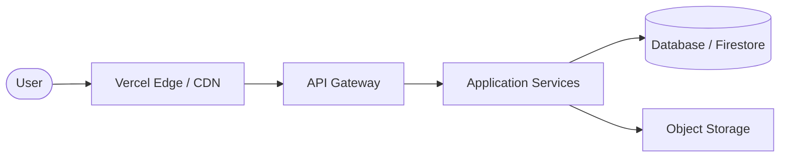

# MechHub

Industrial Commerce Infrastructure for Mechanical Components.

MechHub is a scalable B2B industrial marketplace that connects manufacturers,
suppliers, and buyers for mechanical components such as bearings, fasteners,
CNC parts, and custom manufacturing services.

The platform provides a modern procurement workflow with product discovery,
supplier management, and secure order processing.

---

## Product Vision

Industrial supply chains are still fragmented and inefficient.

Manufacturers struggle to reach buyers.  
Buyers struggle to discover trusted suppliers.

MechHub aims to become the digital infrastructure layer for
industrial component commerce.

---

## Key Features

### Product Marketplace
- Industrial component catalog
- Advanced product filtering
- Detailed technical specifications

### Supplier Platform
- Product listing dashboard
- Inventory management
- Order processing

### Buyer Experience
- Product discovery
- Secure checkout
- Order tracking

### Platform Infrastructure
- Real-time messaging
- Image CDN delivery
- Scalable serverless architecture

---

## System Architecture

High-level architecture of the platform:



### Frontend

- React 19
- Next.js 15
- TailwindCSS

### Backend

- Node.js
- Next.js Edge / Serverless API Routes
- TypeScript

### Data Layer

- Firestore (NoSQL Document Store)
- Firebase Storage (Object Storage)

### Infrastructure

- Vercel
- Resend (Transactional Email provider)

---

## System Design

The platform follows a layered architecture:

```mermaid
flowchart TD
    subgraph Presentation Layer
        UI[React / UI Components]
        State[Context Providers]
    end
    
    subgraph Application Layer
        API[Next.js API Routes]
        Auth[Firebase Auth Services]
    end
    
    subgraph Data Layer
        DB[(Firestore NoSQL)]
        Storage[Firebase Storage]
    end
    
    subgraph Infrastructure Layer
        CDN[Vercel Edge Network]
        Email[Resend Mail Service]
    end

    Presentation Layer --> Application Layer
    Application Layer --> Data Layer
    Data Layer --> Infrastructure Layer
```
*(Diagram modeled after Excalidraw/Whimsical architectural standards)*

---

## Repository Structure

mechhub/
  studio/
    src/
      app/          # Next.js app router and API boundaries
      components/   # Modular React components and UI primitives
      context/      # Global state management
      firebase/     # Client authentication and database hooks
      lib/          # Server utilities and Admin SDK initialization

---

## Local Development

Clone the repository

git clone https://github.com/yourusername/mechhub.git

Navigate to the application directory

cd mechhub/studio

Install dependencies

npm install

Start development server

npm run dev

---

## Environment Variables

Create a `.env.local` file inside the `/studio` directory.

FIREBASE_PROJECT_ID=
FIREBASE_CLIENT_EMAIL=
FIREBASE_PRIVATE_KEY=
NEXT_PUBLIC_APP_URL=
RESEND_API_KEY=
RESEND_FROM_EMAIL=

---

## API Overview

Product APIs

GET /api/v1/admin/products  
POST /api/v1/admin/products/upload  
POST /api/v1/admin/products/upload/delete  

Authentication APIs

POST /api/v1/auth/send-verification  
POST /api/v1/auth/verify-action  

---

## Scalability Design

The platform is designed to support large scale industrial catalogs.

Strategies used:

- Vercel Edge caching layer
- Image CDN for component galleries
- Horizontal serverless scaling
- NoSQL document indexing
- Lazy image and component loading

---

## Performance

- Next/image optimization for WebP delivery
- Edge network static asset delivery
- Debounced database transactions
- Local caching & optimistic UI updates
- Incremental Static Regeneration (ISR)

---

## Security

Security practices implemented:

- Firebase JWT authentication
- Role-based access control (Admin, Vendor, Customer)
- Secure token validation (oobCode integrations)
- Client-side input sanitization
- Absolute environment variable segregation

---

## Deployment

MechHub is built for zero-config Vercel deployments.

Deploy using Vercel CLI:

vercel deploy --prod

Ensure environment variables are configured in the Vercel dashboard prior to deployment.
Private keys are automatically parsed and sanitized for OpenSSL compatibility.

---

## Roadmap

Upcoming platform improvements:

- AI powered product recommendation
- Supplier verification system
- RFQ marketplace
- Logistics integration
- International supplier onboarding

---

## Contributing

Contributions are welcome.

Steps:

1 Fork the repository  
2 Create a new branch  
3 Commit your changes  
4 Submit a pull request  

---

## License

MIT License

---

## Author

Divyanshu Ranjan

Software Engineer  
Founder — MechHub

---

## Acknowledgements

Inspired by modern developer platforms and industrial infrastructure systems.
